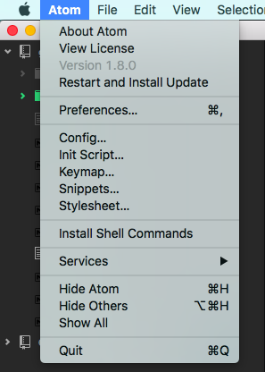

# Atom goodies

## Structuring your workflow into projects

- Click the Add Project Folder… button
- Select the folder of your git repository/project
- It'll appear at the left side of your atom code.
- You can access any of the files and folders inside the project

## Awesome plugins to upgrade your workflow

- Select the preferences menu item

- Select the install menu item in the `Settings` tab.
- Search for the following plugins and install them:
  - The package `logo-file-icons` for icons for your files
  - The package `language-javascript-jsx` for highlighting of JSX components.
  - And many more if you explore!